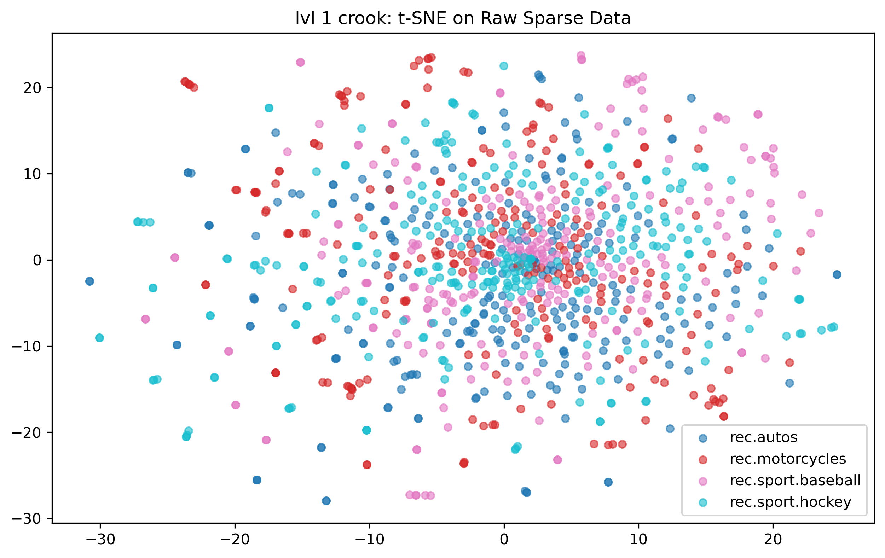
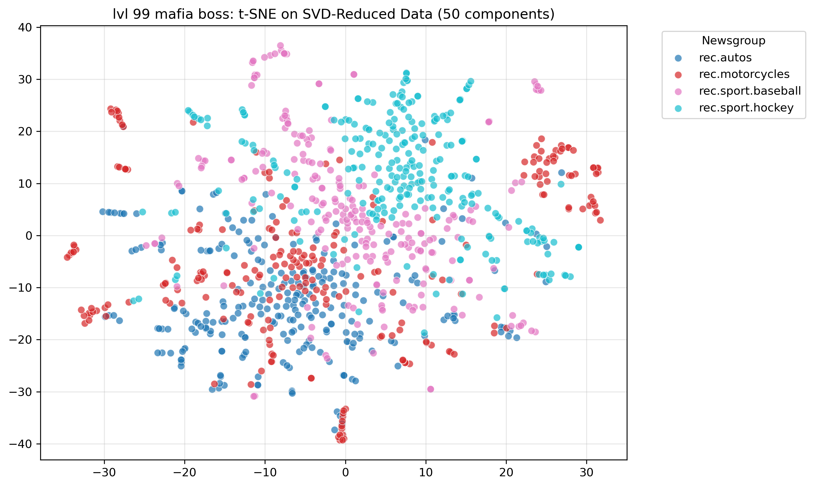

# 📰 newsgroup_semantics

## Manifold Learning & Semantic Discovery Pipeline

Resolving high-dimensional sparsity through optimized latent semantic analysis.

## 🏛️ Architecture

This repository benchmarks **Classical (TF-IDF)** vs. **Embedding-based (Doc2Vec)** architectures for **unsupervised topic discovery**.

It explicitly rejects the _“blob” artifacts_ common in naïve dimensionality-reduction pipelines by enforcing **dense feature initialization before manifold projection**.

### 🧠 Latent Discovery

- Compresses **16,000+ sparse dimensions**
- Produces **50 dense semantic features**
- Preserves global structure before non-linear projection

### 📐 Modular Design

- Clean separation of concerns:
  - **ETL**
  - **Vectorization**
  - **Visualization**
- Production-grade utilities isolated from exploratory notebooks

<h2>🗿 Visual Dominance</h2>

<p><em>Baseline vs. Optimization</em></p>

<table>
  <tr>
    <td align="center">
      <strong>Naïve t-SNE (Raw Sparse)</strong><br>
      
      <br><em>Messy starburst artifact</em>
    </td>
    <td align="center">
      <strong>SVD-Initialized t-SNE</strong><br>
      
      <br><em>Clear semantic islands</em>
    </td>
  </tr>
</table>

<p><strong>Observation:</strong><br>
SVD initialization completely mogs the raw sparse t-SNE. By collapsing the TF-IDF space into a dense, low-rank semantic subspace before non-linear projection, it successfully unfolds the manifold, separating Hockey (Cyan) from Baseball (Pink) where raw Euclidean distance failed. Check notebook for more information. </p>

## 📂 Repository Structure

```plaintext
nlp-clustering-benchmarks/
├── data/                  # 🔒 Gitignored raw assets
├── notebooks/
│   ├── 01_baseline.ipynb  # 🍷 TF-IDF & SVD Optimization
│   └── 02_research.ipynb  # 🚧 Doc2Vec Experimentation (Local)
├── src/                   # 🏗️ Production-grade modules
│   └── utils.py           #    ETL & Preprocessing engine
└── requirements.txt       # 💼 Dependency lockfile
```

## 🚀 Quick Start

Assert dominance over your environment:

```bash
# 1. Clone the repo

git clone https://github.com/YOUR_USERNAME/nlp-clustering-benchmarks.git

# 2. Install dependencies

pip install -r requirements.txt

# 3. Execute the pipeline

jupyter notebook notebooks/01_baseline.ipynb

```
